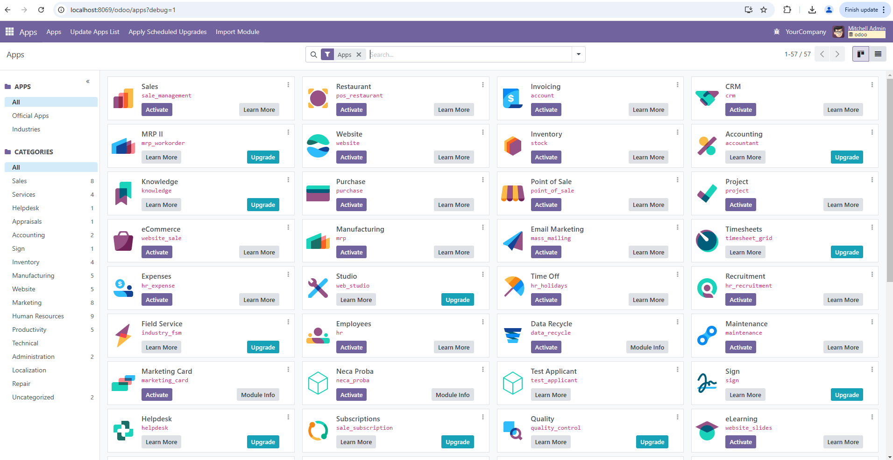
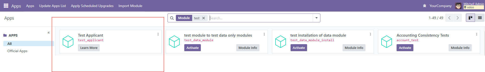
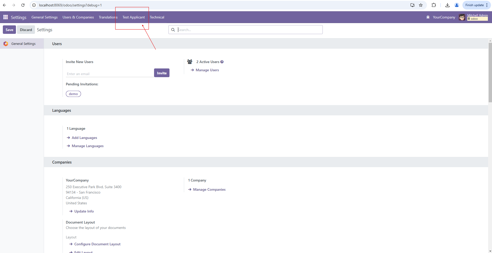
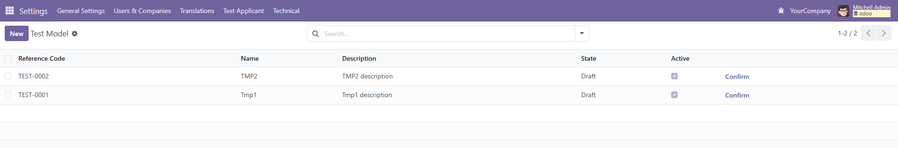
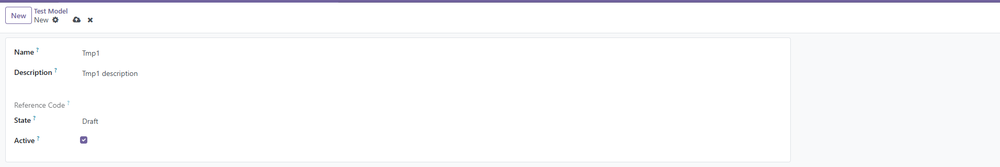
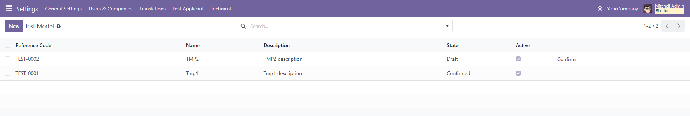
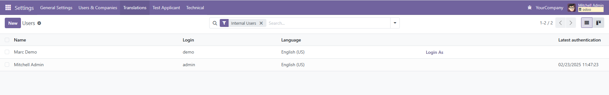
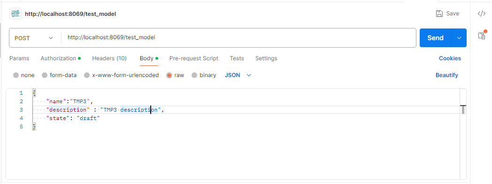
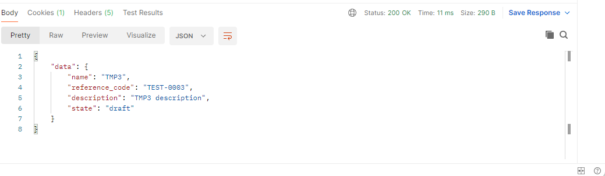
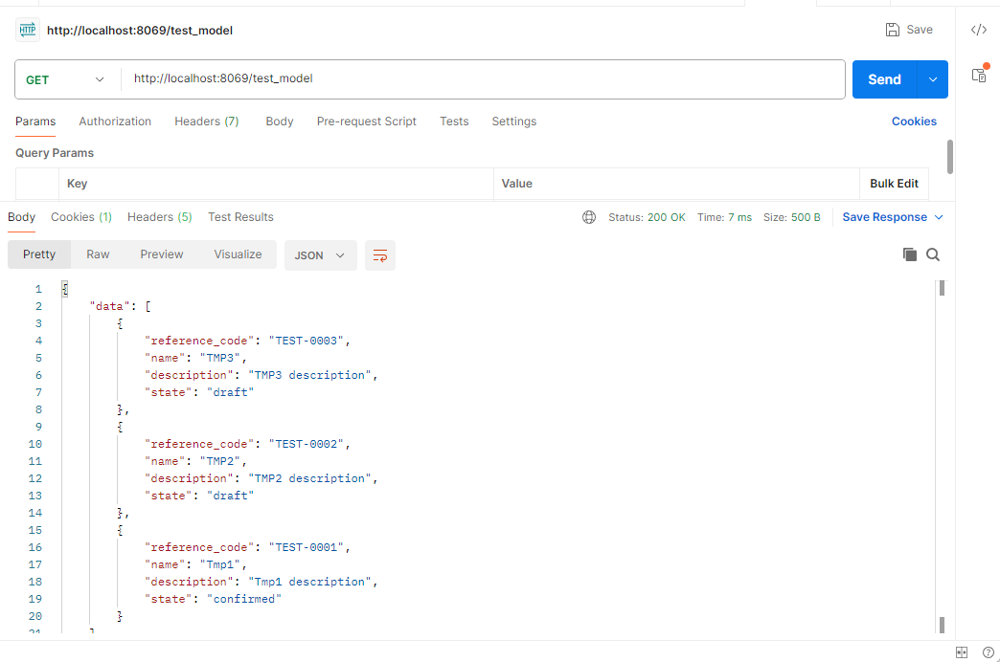

Odoo
----

Odoo is a suite of web based open source business apps.

The main Odoo Apps include an <a href="https://www.odoo.com/page/crm">Open Source CRM</a>,
<a href="https://www.odoo.com/app/website">Website Builder</a>,
<a href="https://www.odoo.com/app/ecommerce">eCommerce</a>,
<a href="https://www.odoo.com/app/inventory">Warehouse Management</a>,
<a href="https://www.odoo.com/app/project">Project Management</a>,
<a href="https://www.odoo.com/app/accounting">Billing &amp; Accounting</a>,
<a href="https://www.odoo.com/app/point-of-sale-shop">Point of Sale</a>,
<a href="https://www.odoo.com/app/employees">Human Resources</a>,
<a href="https://www.odoo.com/app/social-marketing">Marketing</a>,
<a href="https://www.odoo.com/app/manufacturing">Manufacturing</a>,
<a href="https://www.odoo.com/">...</a>

Odoo Apps can be used as stand-alone applications, but they also integrate seamlessly so you get
a full-featured <a href="https://www.odoo.com">Open Source ERP</a> when you install several Apps.

Getting started with Odoo
-------------------------

For a standard installation please follow the <a href="https://www.odoo.com/documentation/master/administration/install/install.html">Setup instructions</a>
from the documentation.

To learn the software, we recommend the <a href="https://www.odoo.com/slides">Odoo eLearning</a>, or <a href="https://www.odoo.com/page/scale-up-business-game">Scale-up</a>, the <a href="https://www.odoo.com/page/scale-up-business-game">business game</a>. Developers can start with <a href="https://www.odoo.com/documentation/master/developer/howtos.html">the developer tutorials</a>

Application 
-------------------------
Main branch is <b>ilexius-test</b>

Application Images
-------------------------
Start page is shown on next image:

Listing available modules:

After instalation module can be found in section settings(without security):

Page with data:

For for adding data:

After clicking on button confirm, status is changed:

Add button Login As(without functionalities, just prevent user with id = 2):

Postman POST request(with basic auth, where app checks if profile exist in db):

Result of post request:

Postman GET request:

